When editing an image in [GNU Image Manipulation Program](https://www.gimp.org/) (GIMP), exporting to PNG can cause
unexpected color shifts. For example, I was editing the green of the VSCodium icon to blue, only to find the exported
PNG on disk remains green.

This issue is caused by the document's color mode constraints, GIMP's rendering engine, & the PNG palette structure.

---

### Diagnosing the Color Shift

The original asset is the VSCodium community icon:
[communityIcon_iwof77n66oi51.png](assets/communityIcon_iwof77n66oi51.png). Inspecting the file metadata with ExifTool
shows a Color Type of "Palette" & a bit depth of 8 bits.

```text
exiftool communityIcon_iwof77n66oi51.png
ExifTool Version Number         : 13.50
File Name                       : communityIcon_iwof77n66oi51.png
Directory                       : .
File Size                       : 38 kB
File Modification Date/Time     : 2026:07:05 20:34:58-05:00
File Access Date/Time           : 2026:07:05 20:34:58-05:00
File Inode Change Date/Time     : 2026:07:05 21:02:57-05:00
File Permissions                : -rw-r-----
File Type                       : PNG
File Type Extension             : png
MIME Type                       : image/png
Image Width                     : 1024
Image Height                    : 1024
Bit Depth                       : 8
Color Type                      : Palette
Compression                     : Deflate/Inflate
Filter                          : Adaptive
Interlace                       : Noninterlaced
Palette                         : (Binary data 768 bytes, use -b option to extract)
Transparency                    : (Binary data 216 bytes, use -b option to extract)
Pixels Per Unit X               : 2835
Pixels Per Unit Y               : 2835
Pixel Units                     : meters
Image Size                      : 1024x1024
Megapixels                      : 1.0
```

This configuration indicates an indexed image. Rather than storing independent red, green, & blue values for each pixel,
the file stores index integers pointing to a palette of up to 256 colors.

The following Python script reads the PNG palette entries using the Pillow library:

```python
from PIL import Image

img = Image.open("communityIcon_iwof77n66oi51.png")
print(f"Image Mode: {img.mode}")

# Print the first five RGB triplets from the palette
palette = img.getpalette()
for i in range(5):
    r = palette[i*3]
    g = palette[i*3 + 1]
    b = palette[i*3 + 2]
    print(f"Index {i}: R={r}, G={g}, B={b}")
```

Running this script outputs the palette color definitions:

```text
Image Mode: P
Index 0: R=0, G=0, B=0
Index 1: R=65, G=138, B=44
Index 2: R=132, G=227, B=93
Index 3: R=0, G=240, B=56
Index 4: R=127, G=217, B=86
```

These RGB triplets correspond to the original green icon design.

---

### Why GIMP Reverts Color Edits in Indexed Mode

When you edit an indexed PNG in GIMP, two factors cause color edits to revert:

- **Active Color Mapping**: If the image mode remains set to Indexed, GIMP prevents you from painting with arbitrary RGB
  colors. If you paint with a color not present in the active colormap, GIMP maps it to the nearest color entry in the
  palette.
- **Layer Composition Rendering**: If you use multi-layer compositions, layer masks, & layer blend modes to modify
  colors, GIMP renders your edits on screen in RGB space. This makes the workspace display the blue edit correctly.
  However, when exporting directly to PNG without changing the document mode, GIMP flattens the image down to the
  document's Indexed mode. This process quantizes the new blue colors back to the closest entries in the original green
  palette.

The following flowchart compares GIMP's export behavior in Indexed mode versus RGB mode:

```mermaid
graph TD
    subgraph Indexed Export Pipeline
        A[Multi-layer Edit in GIMP] --> B[Visual Composition in RGB]
        B --> C[Export to PNG in Indexed Mode]
        C --> D["Flatten Layers"]
        D --> E["Quantize to Active Palette (Green-Only)"]
        E --> F[Green Image on Disk]
    end

    subgraph RGB Export Pipeline
        G[Multi-layer Edit in GIMP] --> H[Visual Composition in RGB]
        H --> I[Image > Mode > RGB]
        I --> J[Export to PNG in RGB Mode]
        J --> K["Flatten Layers"]
        K --> L["Write Color Coordinates Directly"]
        L --> M[Blue Image on Disk]
    end

    style F fill:#4CAF50,stroke:#388E3C,stroke-width:2px,color:#fff
    style M fill:#2196F3,stroke:#1976D2,stroke-width:2px,color:#fff
```



---

### Resolution: Converting to RGB Mode

To preserve color edits on export, convert the image to truecolor RGB mode to bypass the index table constraints:

1. Open the image in GIMP.
2. Select **Image > Mode > RGB** from the top menu.
3. Perform color adjustments.
4. Select **File > Export As...** & export as a PNG.

In RGB mode, GIMP writes raw color coordinates directly to each pixel in the PNG, preserving the blue color instead of
matching it to a green palette entry.

If you must distribute the final asset as an indexed PNG for file size optimization, convert the image back to Indexed
mode after editing:

1. Complete all edits in RGB mode.
2. Select **Image > Mode > Indexed**.
3. In the conversion dialog, select **Generate optimum palette** with a maximum of 256 colors. GIMP will calculate a new
   palette tailored to the blue artwork.
4. Export the image.

---

### Verification of the Exported Palette

After exporting the new blue image as `codium_blue.png` using the re-indexing method, we can run ExifTool & the Python
verification script again to confirm the color values in the palette updated correctly.

```text
exiftool codium_blue.png
...
Color Type                      : Palette
```

Running the Pillow script on the new file shows that the green & blue color channels have swapped:

```text
Image Mode: P
Index 0: R=0, G=0, B=0
Index 1: R=65, G=44, B=138
Index 2: R=132, G=93, B=227
Index 3: R=0, G=56, B=240
Index 4: R=127, G=86, B=217
```

This confirms that the physical palette chunk (`PLTE`) contains the blue coordinates, & the asset will render correctly
on all devices.

---

### Bonus: GIMP Configuration Defaults for Design Workflows

Beyond resolving specific export errors, setting up a fresh GIMP installation with optimal preferences ensures
consistent color reproduction & smooth canvas performance.

- **Toolbox Layout**: Disable **Use tool groups** under **Edit > Preferences > Interface > Toolbox** to display all
  tools individually. This eliminates the need to right-click to access nested tools.
- **Icon Theme**: Switch **Icon Theme** to **Color** or **Legacy** in **Edit > Preferences > Interface > Icon Theme**.
  The default flat gray icons can be difficult to distinguish quickly; color coding restores visual landmarks.
- **Dynamic Keyboard Shortcuts**: Enable **Use dynamic keyboard shortcuts** under **Edit > Preferences > Interface**.
  This lets you map custom shortcuts by hovering over a menu item & pressing a key combination.
- **Tile Cache Allocation**: In **Edit > Preferences > System Resources**, set **Tile Cache** to 50%-75% of your system
  RAM. GIMP defaults to a conservative cache size, which can cause lag on large canvas operations.
- **Color Space Normalization**: Set **File Open Behavior** to **Convert to preferred RGB color space** under **Edit >
  Preferences > Color Management** to bypass color profile mismatch dialogs on import.
- **PhotoGIMP Layout Template**: For users transitioning from Photoshop, the
  [PhotoGIMP](https://github.com/Diolinux/PhotoGIMP) patch adjusts GIMP's keyboard shortcuts, toolbox layout, & panel
  organization to mimic Photoshop. If running GIMP as a Flatpak on Fedora or similar systems, you can use the
  [photogimp-flatpak-fedora](https://github.com/KnowOneActual/photogimp-flatpak-fedora) script to automate configuration
  directory matching.

---

### Further Reading & Resources

To learn more about color modes, metadata extraction, & GIMP configuration, refer to the following resources:

- **Image Color Modes**: The [GIMP Image Modes Documentation](https://docs.gimp.org/en/gimp-image-modes.html) explains
  the differences between RGB, Grayscale, & Indexed modes.
- **PNG Structure**: The W3C [PNG Specification (PLTE chunk)](https://www.w3.org/TR/png-3/#11PLTE) details how indexed
  colors are stored in the physical file format.
- **Pillow Library**: The
  [Pillow Image Module documentation](https://pillow.readthedocs.io/en/stable/reference/Image.html) outlines helper
  functions for parsing image data with Python.
- **ExifTool**: The [ExifTool website](https://exiftool.org/) provides command reference guides for reading & writing
  image metadata.
