Most password managers, including Bitwarden, 1Password, and Proton Pass, allow users to export their database. This is a
standard practice for maintaining an emergency backup offline.

However, the export files are usually written in plain text, such as unencrypted `.csv` or `.json` files. If these files
sit in a user's Downloads directory, any local application, running malware, or unauthorized person with device access
can copy them instantly.

---

### SSD Wear-Leveling and File Erasure Risks

A common mistake is exporting the backup to the desktop, copying it to an external drive, and then deleting the local
file. On modern solid-state drives (SSDs), standard file deletion does not instantly overwrite the physical sectors
containing the data.

SSDs use wear-leveling algorithms that distribute writes evenly across the physical flash cells. When a file is deleted
or overwritten, the drive marks the sectors as unallocated but may defer erasing them. Forensic utilities can recover
these remnants of plaintext passwords from raw flash blocks.

Encrypted disk containers solve this problem. These containers function as files that mount as virtual drives. When you
write data to the mounted drive, it decrypts dynamically in system memory (RAM). When you unmount the container, the
physical file remains fully encrypted using AES-256 or another strong cipher, preventing direct recovery from the
physical disk sectors.

The following flowchart compares the data lifecycle of a plaintext export with a secure encrypted container workflow:

```mermaid
graph TD
    subgraph Plaintext Export Lifecycle
        A[Export Password Vault] --> B[Plaintext CSV or JSON in Downloads]
        B --> C[Send to Trash Bin]
        C --> D[Undeleted Remnants Exist in SSD Flash Cells]
        D --> E[Vulnerable to Forensic Extraction]
    end

    subgraph Encrypted Disk Lifecycle
        F[Export Password Vault] --> G[Write Directly into Mounted Drive]
        G --> H[Unmount and Eject Virtual Drive]
        H --> I[Plaintext Decrypted Solely in System RAM]
        I --> J[Encrypted AES-256 Container File on Disk]
    end

    style E fill:#fdd,stroke:#f66,stroke-width:2px
    style J fill:#dfd,stroke:#6c6,stroke-width:2px
```



---

### Encrypted Containers on macOS

On macOS, the operating system supports encrypted disk images natively through Disk Utility and command-line utilities.

#### Creating Containers with macOS Disk Utility

1. Launch **Disk Utility** (press `Command + Space`, type "Disk Utility", and press Enter).
2. Select **File > New Image > Blank Image...** from the top menu.
3. Configure the container:
   - **Save As**: `SecureVault`
   - **Where**: Choose a directory (such as your Documents folder).
   - **Name**: `SecureVault`
   - **Size**: 500 MB (sufficient for password files).
   - **Format**: APFS.
   - **Encryption**: Select **256-bit AES encryption**. Enter a strong password and save it in a secure physical
     location.
   - **Image Format**: Select **sparse disk image**. This format dynamically adjusts the file size on disk based on the
     actual files contained within it.
4. Click **Save**. macOS creates the disk image and automatically mounts the virtual volume.

#### Creating Containers via macOS Terminal

Run the following command in Terminal to create the same APFS-formatted sparse disk image:

```bash
hdiutil create -size 500m -encryption AES-256 -fs apfs -volname "SecureVault" -type SPARSE ~/Documents/SecureVault.sparseimage
```

You will be prompted to set and verify the decryption password.

---

### Encrypted Containers on Windows

Windows Pro, Enterprise, and Education editions support BitLocker encryption on Virtual Hard Disks (VHDX). Windows Home
users do not have full BitLocker write capabilities and should use the cross-platform VeraCrypt option instead.

#### Creating VHDX Containers via Windows Disk Management

1. Right-click the Start menu and select **Disk Management** (or press `Windows Key + R`, type `diskmgmt.msc`, and press
   Enter).
2. Select **Action > Create VHD** from the menu bar.
3. Configure the disk settings:
   - **Location**: Save the file to a secure path (such as `C:\Users\<Username>\Documents\SecureVault.vhdx`).
   - **Virtual hard disk size**: `500 MB`.
   - **Virtual hard disk format**: Select **VHDX** for resilience against power-loss corruption.
   - **Virtual hard disk type**: Select **Dynamically expanding**.
4. Click **OK**.
5. In the lower pane, right-click the new disk entry (labeled "Unknown" and "Not Initialized") and select **Initialize
   Disk**.
6. Choose **GPT** (GUID Partition Table) partition style and click **OK**.
7. Right-click the unallocated space on the disk and select **New Simple Volume**. Click through the wizard, format the
   filesystem as **NTFS** or **exFAT**, and set the Volume Label to `SecureVault`.
8. Open File Explorer, locate the new drive letter, right-click it, and select **Turn on BitLocker**.
9. Choose **Use a password to unlock the drive**, enter a strong password, and save the recovery key to a physical safe.
10. To close the vault, right-click the drive in File Explorer and select **Eject**. Double-clicking the `.vhdx` file
    mounts it again and prompts for the password.

#### Creating VHDX Containers via PowerShell

Run PowerShell as Administrator and execute the following commands to create, mount, partition, and encrypt the virtual
drive:

```powershell
# Create and mount the virtual disk
$vhdPath = "$Home\Documents\SecureVault.vhdx"
New-VHD -Path $vhdPath -SizeBytes 500MB -Dynamic | Mount-VHD

# Partition and format the new disk
$disk = Get-Disk | Where-Object PartitionStyle -eq "RAW"
Initialize-Disk -Number $disk.Number -PartitionStyle GPT
$partition = New-Partition -DiskNumber $disk.Number -UseMaximumSize -AssignDriveLetter
Format-Volume -DriveLetter $partition.DriveLetter -FileSystem NTFS -NewFileSystemLabel "SecureVault"

# Enable BitLocker encryption
Enable-BitLocker -MountPoint "$($partition.DriveLetter):" -EncryptionMethod Aes256 -UsedSpaceOnly -PasswordProtector
```

---

### Encrypted Containers on Linux

Linux environments support disk encryption through LUKS (Linux Unified Key Setup). You can manage these containers using
graphical utilities like GNOME Disks or the command line.

#### Creating LUKS Containers via GNOME Disks

1. Open the **Disks** utility (`gnome-disks`).
2. Click the three-dot menu icon in the window header and select **New Disk Image...**.
3. Configure the settings:
   - **Name**: `SecureVault.img`
   - **Folder**: Choose a local directory.
   - **Size**: 500 MB.
   - **Partitioning**: Choose **No partitioning (single volume)**.
4. Click **Create**.
5. Select the filesystem format **LUKS + ext4** (or **LUKS + FAT** if you need cross-compatibility with other operating
   systems).
6. Enter a strong password and click **Create**.
7. Double-click the `.img` file in your system file manager to mount it. To unmount it, click the eject icon next to the
   drive in the sidebar.

#### Creating LUKS Containers via the Command Line

Open a terminal and run the following command sequence to create a LUKS-encrypted container:

```bash
# Allocate a 500 MB raw image file
dd if=/dev/zero of=~/Documents/SecureVault.img bs=1M count=500

# Format the file as a LUKS encrypted volume
cryptsetup luksFormat ~/Documents/SecureVault.img

# Map the encrypted volume to a loop device
sudo cryptsetup open ~/Documents/SecureVault.img securevault

# Create an ext4 filesystem inside the mapped volume
sudo mkfs.ext4 /dev/mapper/securevault

# Mount the filesystem to a mount point
mkdir -p ~/SecureVault
sudo mount /dev/mapper/securevault ~/SecureVault
```

To close and lock the volume:

```bash
sudo umount ~/SecureVault
sudo cryptsetup close securevault
```

---

### Cross-Platform Alternative: VeraCrypt

If you operate in a mixed-OS environment or run Windows Home, VeraCrypt is an open-source option that works identically
across macOS, Windows, and Linux.

1. Download and install [VeraCrypt](https://www.veracrypt.fr/).
2. Click **Create Volume** and select **Create an encrypted file container**.
3. Choose **Standard VeraCrypt volume** and select a file location (such as `SecureVault.hc`).
4. Select **AES** as the encryption algorithm and **SHA-512** as the hash algorithm.
5. Set the volume size to 500 MB.
6. Specify a strong password.
7. Format the volume using **exFAT** or **FAT** to ensure read and write capability on all systems.
8. Mount the file using the VeraCrypt desktop application to transfer files, and click **Dismount** to lock the
   container.

---

### Security Best Practices

To avoid permanent data loss or accidental leaks, observe the following rules:

- **Physical Recovery Key Storage:** If you lose the encryption password, the container data is irrecoverable. Write the
  container password and any recovery keys on paper and store them in a fireproof physical safe. Do not store the
  container password inside the password manager you are backing up.
- **Direct Export Paths:** When exporting your database from the browser or desktop app, set the destination path
  directly to the mounted encrypted drive. Avoid saving the file to Downloads first.
- **The 3-2-1 Backup Strategy:** Keep at least three copies of the encrypted container file, on two different types of
  media (such as your local SSD and a USB flash drive), with one copy stored in an off-site location.

---

### Further Reading and Documentation

Refer to these official technical references to learn more about the tools and security protocols used in this guide:

- **APFS and hdiutil:** Apple's official
  [hdiutil manual page](https://support.apple.com/guide/disk-utility/create-a-disk-image-dskutl1184/mac) covers disk
  image formatting options.
- **BitLocker Configuration:** Microsoft's documentation on
  [BitLocker Drive Encryption Cmdlets](https://learn.microsoft.com/en-us/powershell/module/bitlocker/) provides advanced
  parameters for volume encryption.
- **LUKS Security:** The standard specifications are detailed on the
  [cryptsetup GitLab page](https://gitlab.com/cryptsetup/cryptsetup).
- **VeraCrypt Encryption:** The [VeraCrypt documentation website](https://www.veracrypt.fr/en/Documentation.html)
  explains container architectures and security audits.
